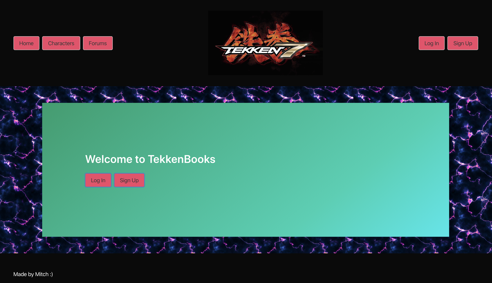
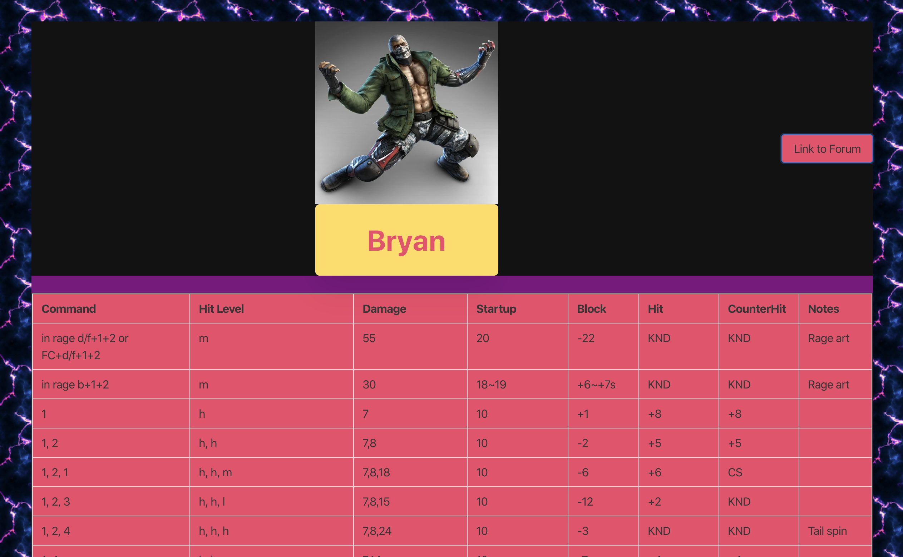
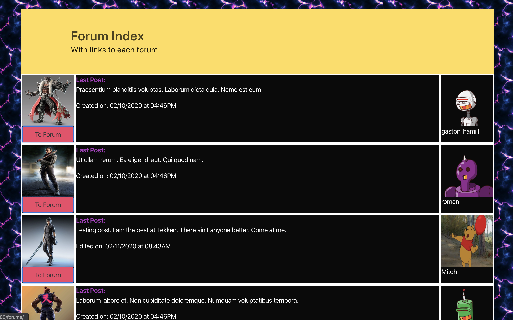
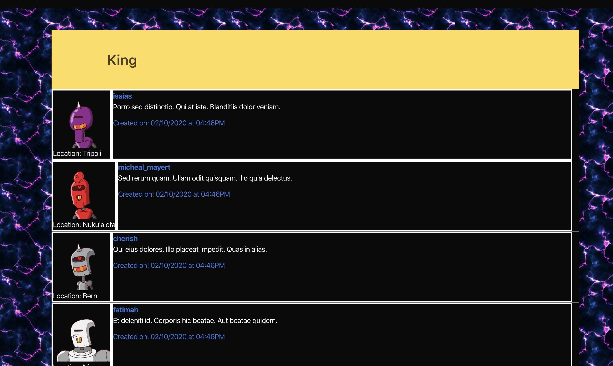
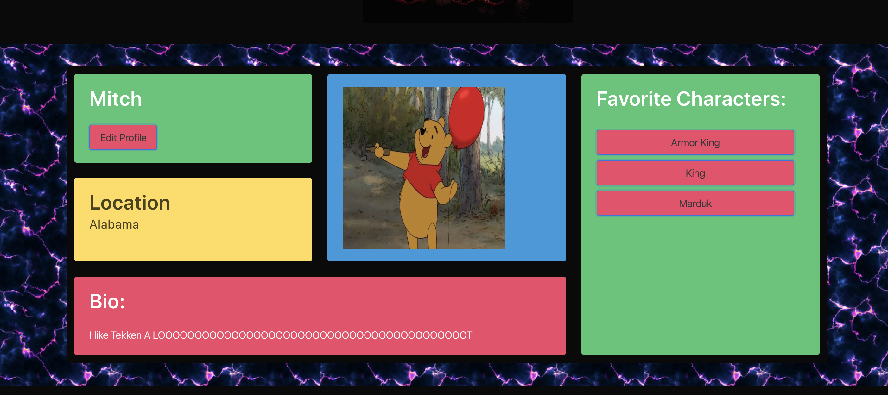

# Tekken Frame Data App

## Project Description

Hello, and welcome to my app. As a project to explore and practice Rails, I wanted to make a website centered around something I love: fighting games, and sepcifically the game Tekken 7. All fighting games have characters with a lot of moves that players study obsessively to inorder to inform their desicion making mid-match. The characteristics for each move are broken down into characteristics that each move has and referred to as frame data.

I want to create a site for users to look up frame data for each character, with an attached forum to discuss the ins and outs, while also acting as a place to community build.

## Technologies Used

* Ruby on Rails
* Bulma
* API
* CSS
* Bcrypt
* Kaminari

## Installiation

* Clone the repo to your computer
* Navigate to the directory and run `bundle install`
* run `rails db:migrate` and `rails db:seed`. This should take a couple seconds. The api has to pull 8460 moves and 45 characters.
* run `rails s`
* The site should be live at http://localhost:3000/

## Schema

My model schema is this:

A character <-> has many moves, that belong to a character

A forum <-> belongs to a character

A forum has many <-> posts and a post belongs to a user

A user has many <-> posts and a post belongs to a user

A favorite belongs to a User, and a character

## User Stories

My basic user stories are:

* A user can look up characters and their moves
* A user can make posts on a forum related to a specific character
* A user can edit and delete their own posts
* A user can read other user's posts, and look at those user's pages
* A user can edit thier own page
* A user can favorite a character and have a link to that character's page show up on thier page
* A user can report another user's post
* An admin user can see the reports, and delete users based off of them

## Walkthrough of Site Functionality:

The homepage for the app shows a welcome message, as well as login and signup buttons. The user can use either one to login, the signup will make a new user class for that user. A user must have a username and password to sign up. After login, the site will redirect back to the page the user was on before. When seeing the home page while logged in, the user will see a message to them and a logout buttons.

At the top of the page, on the layout, there will always be buttons to the home page, character index page, and forum index pages. There are also login, signup, logout, and profile page buttons for the user depending on if they are logged in or not.

The character index page has all the characters images laid out in a grid, with buttons with their names on it that are links to that individual character's show page.

The individual character's show page has all of the character's moves listed in table form. Each move has the right real world properties pulled from an API. At the top of the page their is a link to the character's forum, and, if the user is logged in, a button to either favorite or unfavorite a character.

The forum index page has all of the forums listed in lines. Each line has a link to that forum, as well as the latest post in that forum.

For the forum show pages, it displays the first five posts made on that forum. Buttons at the bottom of the page move the user forward and back through the posts. If the user is logged in, the page has a form to make a new post on that forum at the bottom. A post cannot have more than 500 characters. If the logged in user has any posts on that page, they have a button to the right of that post to go to an edit form for that post. A logged in user can also report a user. An email will be generated and then sent to the admin user. The admin user can then log in and see the reports on their page. That admin can approve and deny the requests to delete that user. And all of their associations.

On an individual user's profile page it shows their picture, their username, their location, and their bio. It also has a list of all of their favorite characters, with links to that character's show page. If the user for that page is the currently logged in user, there will also be a button to go to an edit form for the user.

## Difficulties

* Learning Bulma, and by extension css, was a challenge for me, as I've had no real previous experience in either before this project and had to learn on my own. I'm happy with how it turned out for a first try, and I feel much more comfortable with both technologies. There's still some things I wish could be better about my styling, and if there's a convention to stick to, I did not follow it at all.

* In extension to the above point, learning how to use forms without rails helper methods was a little difficult. But overall not too bad. Eventually I found out you can partially implement them with bulma styling so it was a small waste anyway, but that's how it is sometimes.

* Getting comfortable with passing params and other information correctly when rails helper methods didn't explicitly do it for me. I definetly have everything working cleaner now than I did before. 

* Adding pagination was easier than I expected it to be. However linking to a specif page for a posts with the way I had my forum routes set up took a while to figure out. I needed to make a pretty bulky helper method.

## Credits

* [rbnorway](https://www.example.com) - The site my api pulled from for the Tekken data.

* [tkshehan's Tekken API](https://github.com/tkshehan/t7-server) - The API I used to get my data.